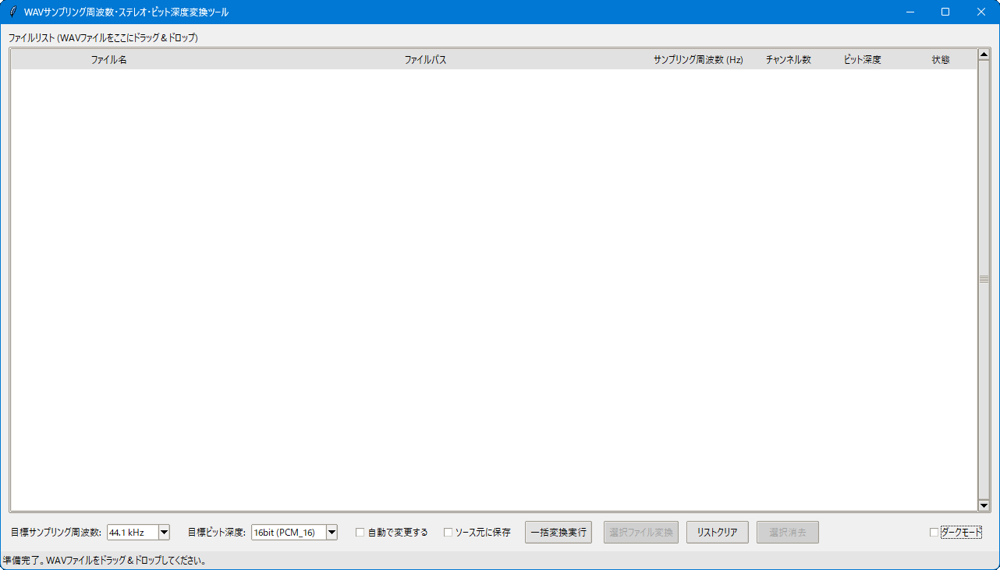
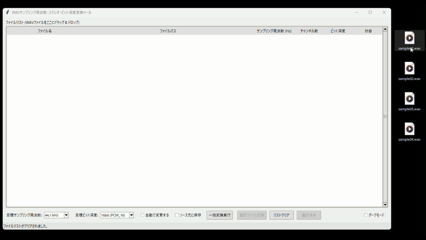
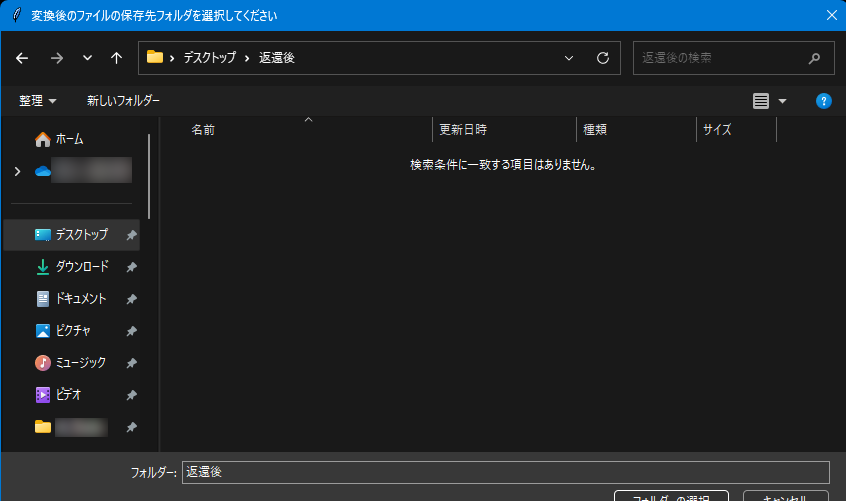
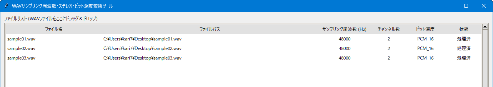

# WAVサンプリング周波数一括変更ツール (WavResampler)

**バージョン: 1.20**
**最終更新日: 2024-05-16**
*(このドキュメントはバージョン1.10に対応した最新のものです)*

このツールは、複数のWAVファイルのサンプリング周波数を一括で、または自動で変更することができるデスクトップアプリケーションです。Windowsユーザー向けには実行ファイル (`.exe`) を、Python環境をお持ちのユーザー向けにはPythonスクリプト (`.py`) を提供します。

<p align="center">
  <br>
  (Winodws用の WavResampler.exe ファイルのアイコン)
</p>

<p align="center">
  
</p>

## 主な機能

*   **テーマ切り替え**: ダークモードとライトモードに対応しています。
*   WAVファイルの**サンプリング周波数**、**ビット深度**（16bit/8bit）、**チャンネル数**（ステレオ固定）を一括で変換します。（モノラルファイルの場合、強制的にステレオ化します）
*   **ドラッグ＆ドロップ**: WAVファイルをリストに簡単に追加できます（複数ファイル対応）。
*   **ファイル情報表示**: リストにはファイル名、フルパス、元のサンプリング周波数、処理状態が表示されます。
*   **目標サンプリング周波数指定**: `22.05KHz`、`24KHz`、`32KHz`、`44.1KHz`、`48KHz`から目標サンプリング周波数を選択指定できます。
*   **目標ビット深度指定**: `16bit(PCM_16)`、`8bit(PCM_S8)`から目標ビット深度を指定できます。
*   **一括変換**: リストに追加された全てのファイルを指定したサンプリング周波数に変換し、指定フォルダに保存します。
*   **自動変換**: チェックボックスをONにすると、ファイルがリストに追加された時点で自動的に変換処理が開始されます。
*   **ソース元に保存**: 変換後ファイルを元のファイルと同じ場所に保存できます。
*   **リスト管理**: リスト全体のクリア、選択したアイテムの消去が可能です。
*   **ステータス表示**: 現在の操作状況や処理結果がリアルタイムで表示されます。
*   **出力先フォルダ記憶**: 前回指定した変換ファイルの保存先フォルダを記憶し、次回起動時に自動的に設定します。
*   **柔軟なファイル操作**: リストからの個別ファイル変換、選択消去、リストクリアが可能です。
*   **変更スキップ機能**: 変更元ファイルが変更する目標ビット深度、目標サンプリング周波数が同じである場合、変更処理をスキップします。

## 必要なもの

本アプリケーションは、以下のいずれかの方法でご利用いただけます。

### 1. 実行ファイル (`WavResampler.exe`) を使用する場合 (Windowsユーザー向け)
*   **対応OS**: Windows
*   特に必要な追加ソフトウェアはありません。`WavResampler.exe` を直接実行できます。

### 2. Pythonスクリプト (`WavResamples.py`) を使用する場合
*   **対応OS**: Python及び関連ライブラリが動作する環境 (Windows, macOS, Linuxなど)
*   **Python**: バージョン 3.8 以上を推奨 (詳細は「開発・ビルド情報」参照)
*   **必要なPythonライブラリ**:
    *   `tkinter` (通常Pythonに同梱)
    *   `tkinterdnd2`
    *   `librosa`
    *   `soundfile`
    *   これらのライブラリは `pip` を使ってインストールできます:
        ```bash
        pip install tkinterdnd2 librosa soundfile
        ```
    (詳細は後述の「開発・ビルド情報」のライブラリ表もご参照ください。)
    **(`numpy`は`librosa`の依存関係にあるため、`librosa`と一緒にインストールされます)**

### 開発・ビルド情報 (参考)

Windowsで実行ファイル (`WavResampler.exe`) を使用する場合、エンドユーザーが別途Pythonやライブラリをインストールする必要はありません。Pythonスクリプト (`WavResamples.py`) を直接実行する場合は、Python環境と以下にリストされている主要ライブラリのインストールが必要です。このセクションの情報は、開発時の環境および使用した主要ライブラリに関する参考情報です。

*   **Python**:
    *   開発時使用バージョン: `3.12.9`
    *   (参考) ビルドに使用したライブラリの互換性を考慮すると、一般的に **Python 3.8 以上** での開発・ビルドが推奨されます。

*   **主要Pythonライブラリ**:

    | ライブラリ名    | 本ツールでの主な用途     | 開発時の使用バージョン (目安) | 最新版 (2025年5月時点目安) | Python互換性 (最新版目安) |
    | :-------------- | :----------------------- | :-------------------------- | :------------------------- | :------------------------ |
    | `tkinter`       | GUIフレームワーク        | Python 3.12.9 同梱        | Python同梱                 | Python 3.x                |
    | `tkinterdnd2`   | ドラッグ＆ドロップ機能   | 0.4.3                       | 0.4.3+                     | Python 3.6+               |
    | `librosa`       | オーディオ分析・リサンプル | 0.11.0                      | 0.11.0                     | Python >=3.8              |
    | `soundfile`     | WAVファイルの読み書き    | 0.13.1                      | 0.13.1                     | Python >=3.7              |
    | `numpy`         | 数値計算ライブラリ          | 2.2.6(librosa使用のため2.2.6を使用) | 2.3.1                     | Python >=3.8, <3.13       |
 | `pyinstaller`   | スクリプトのexe化       | 6.14.1                      | 6.14.1                     | Python >=3.8, <3.13       |

> [!IMPORTANT]
> *   上記の「開発時の使用バージョン (目安)」および「最新版 (2025年5月時点目安)」は、2025年5月時点での情報に基づいた目安です。
> *   各ライブラリの正確なPythonバージョン互換性や最新情報については、それぞれの公式ドキュメント (PyPIなど) をご確認ください。
> *   Windowsユーザー向けに提供される `WavResampler.exe` ファイルは単体で動作し、Pythonや上記ライブラリの別途インストールは不要です。
> *   Pythonスクリプト (`WavResamples.py`) を使用する場合は、これらのインストールが必要になります。

---
## 使い方

### 1. アプリケーションの起動

#### Windows で実行ファイル (`WavResampler.exe`) を使用する場合
1.  配布された `WavResampler.exe` ファイルをダブルクリックして実行します。
2.  メインウィンドウが表示されます。（起動時は通常（ライト）モードです）

#### Pythonスクリプト (`WavResamples.py`) を使用する場合
1.  お使いのシステムに Python (3.8以上推奨) がインストールされていることを確認してください。ターミナルまたはコマンドプロンプトで以下のコマンドを実行して確認してください。
    ```bash
    python -V
    ```
2.  必要なライブラリ (`tkinterdnd2`, `librosa`, `soundfile`) をインストールします。ターミナルまたはコマンドプロンプトで以下のコマンドを実行してください:
    ```bash
    pip install tkinterdnd2 librosa soundfile
    ```
    *   `tkinter` は通常Pythonの標準ライブラリとして同梱されています。
3.  配布された `WavResamples.py` ファイルがあるディレクトリに移動し、以下のコマンドでスクリプトを実行します:
    ```bash
    python WavResamples.py
    ```
4.  メインウィンドウが表示されます。（起動時は通常（ライト）モードです）

---

  > [!NOTE]
  > 以下、メインウィンドウ表示後の操作方法は共通です
  <p align="center">
    <br>
    （通常（ライトモード）時）
  </p>
  <p align="center">
    <br>
    （ダークモード時）
  </p>
  <p align="center">
    <br>
    （通常（ライトモード）からダークモードに変更）
  </p>

    
---

### 2. ファイルの追加

1.  変換したいWAVファイルをエクスプローラーなどから選択します。
2.  選択したファイルを、ツールウィンドウ内のファイルリスト領域（「ファイルリスト (WAVファイルをここにドラッグ＆ドロップ)」と書かれた部分）へドラッグ＆ドロップします。
3.  ファイルがリストに追加され、ファイル名、パス、現在のサンプリング周波数、状態（初期は空欄）が表示されます。

    <p align="center">
      
      
    </p>

---
### 3. 目標サンプリング周波数の設定

1.  「目標サンプリング周波数」のプルダウンを開いて、変換したい周波数を選択します。

    <p align="center">
      
    </p>

---
### 4. 目標ビット深度の指定

1.  「目標ビット深度」のプルダウンを開いて、変換したいビット深度を選択します。

    <p align="center">
      
    </p>

---
### 5. 変換モードの選択と実行

#### 5.1. 一括変換モード（手動実行）

1.  「自動で変更する」チェックボックスが **オフ** になっていることを確認します。
    <p align="center">
      
    </p>
2.  リストにファイルが追加され、目標サンプリング周波数が設定されたら、「一括変換実行」ボタンをクリックします。
    <p align="center">
      
    </p>
3.  「変換後のファイルの保存先フォルダを選択してください」というダイアログが表示されます。変換されたファイルを保存するフォルダを選択し、「フォルダーの選択」をクリックします。
    *   **出力先フォルダ記憶**: このとき選択したフォルダは記憶され、次回「一括変換実行」ボタンクリック時にデフォルトの保存先として提案されます。

    <p align="center">
      
    </p>

4.><br>
      (例：ここでは、ピクチャフォルダに作成した返還後フォルダを選択している)
    </p>

4.  変換処理が開始されます。各ファイルの処理状況はリストの「状態」列とウィンドウ下部のステータスバーに表示されます。
5.  全ての処理が完了すると、メッセージボックスで結果が通知されます。

    <p align="center">
      
    </p>
    <p align="center">
      
    </p>

#### 5.2. 自動変換モード

1.  「自動で変更する」チェックボックスを **オン** にします。
    <p align="center">
      
    </p>
2.  初めて自動変換モードをONにした場合、または出力先が未設定の場合は、「自動変換ファイルの保存先フォルダを選択」ダイアログが表示されます。自動変換されたファイルを保存するフォルダを選択します。
    <p align="center">
      
    </p>
    *   この出力先は、自動変換モードがONの間、記憶されます。
    *   **出力先フォルダ記憶**: また、この出力先は次回アプリケーション起動時や、再度自動変換モードをONにした際にも自動的に設定されます。
3.  目標サンプリング周波数を設定します。(既に設定済みの場合はその設定が使用されます)
4.  この状態でWAVファイルをリストにドラッグ＆ドロップすると、ファイルが追加されると同時に「状態」が「キュー済」となり、バックグラウンドで自動的に変換処理が開始されます。
    <p align="center">
      
    </p>  
5.  処理が完了すると、リストの「状態」列が「処理済」または「エラー」に更新され、ステータスバーにも結果が表示されます。
    <p align="center">
      
    </p>

    *   **注意**: 自動変換モード中でも、目標サンプリング周波数の設定はいつでも変更可能です。ただし、既にキューに入っているファイルは、キューイングされた時点のサンプリング周波数設定で処理されます。

---
### 5.3. 個別変換モード

リストに追加されたファイルの中から、特定のファイルのみを選択して変換・保存することができます。

1.  「自動で変更する」チェックボックスが **オフ** になっていることを確認します。
    <p align="center">
      
    </p>
2.  リスト内の変換したいファイルをクリックして選択します（複数選択可: Ctrl+クリック、Shift+クリック）。
    <p align="center">
      
    </p>
3.  メインウィンドウのコントロールパネルにある「選択ファイル変換」ボタンをクリックします。
    <p align="center">
      
    </p>
4.  出力先フォルダの指定:
    *   「ソース元に保存」チェックボックスが **オフ** の場合:
        「変換後のファイルの保存先フォルダを選択してください」というダイアログが表示されます。変換されたファイルを保存するフォルダを選択し、「フォルダーの選択」をクリックします。
        <p align="center">
          
        </p>
        *   **出力先フォルダ記憶**: このとき選択したフォルダは記憶され、次回、個別変換で再度フォルダ指定が必要な場合にデフォルトの保存先として提案されます（アプリケーションのセッション中のみ有効）。
    *   「ソース元に保存」チェックボックスが **オン** の場合:
        変換されたファイルは、元のファイルと同じフォルダに保存されます。この場合、フォルダ選択ダイアログは表示されません。
5.  選択されたファイルの変換処理が開始されます。各ファイルの処理状況はリストの「状態」列とウィンドウ下部のステータスバーに表示されます。
    <p align="center">
      
    </p>
6.  処理が完了すると、リストの「状態」が更新され、場合によってはメッセージボックスで結果が通知されます。
    <p align="center">
      <!-- (例：個別変換完了後のリスト状態のスクリーンショットなど) -->
      <br>
      (例：例：個別変換完了後のリスト状態と個別変換完了のメッセージボックス)
    </p>

---
### 6. リストの操作

*   **リストクリア**: 「リストクリア」ボタンをクリックすると、ファイルリスト内の全てのアイテムが削除されます。
*   **選択消去**:
    1.  リスト内の消去したいアイテムをクリックして選択します（複数選択可: Ctrl+クリック、Shift+クリック）。
    2.  「選択消去」ボタンが有効になるので、クリックします。
    3.  選択されたアイテムがリストから削除されます。

    <p align="center">
      <br>
    </p>

---
### 7. アプリケーションの終了

ウィンドウ右上の「×」ボタンをクリックします。
終了確認のメッセージボックスが表示されるので、「OK」をクリックするとアプリケーションが終了します。

## 注意事項

*   処理対象はWAVファイル(`.wav`, `.wave`)のみです。
*   変換後のファイル名は、元のファイル名に `_resampled_目標周波数Hz` が付加された形式になります。（例: `sample.wav` → `sample_resampled_48000Hz.wav`）
*   非常に大きなファイルや多数のファイルを一度に処理する場合、時間がかかることがあります。
*   エラーが発生した場合は、ステータスバーやメッセージボックスで通知されます。リストの「状態」列も「エラー」と表示されます。
*   アンチウイルスソフトによっては、初回起動時に警告が表示される場合があります。信頼できる配布元からのファイルであることを確認してください。
*   アンチウイルスソフトによっては、実行ファイル (`.exe`) の初回起動時に警告が表示される場合があります。信頼できる配布元からのファイルであることを確認してください。
*   ファイルリストの「サンプリング周波数」および「状態」カラムは、表示幅が固定されています。これらのカラムを縮めることはできませんが、マウス操作によって意図せず幅が広がってしまう場合があります。その場合は、アプリケーションを再起動すると元の表示幅に戻ります。

---
## 更新履歴

| 更新日付   | バージョン | 降臨履歴                                   |
| :--------- | :------- | :--------------------------------------- |
| 2025/07/04 | 2.00     | 【機能追加】カラーテーマ（通常（ライト）モード、ダークモード）切り替え機能、返還後の目標サンプリング周波数のコンボボックス化、目標ビット深度のコンボボックス、上書き対象ファイルの処理スキップ機能、強制ステレオ変換機能。\n【バグ修正】機能追加によりモノラルへの変換、指定ビット深度外への変換バグ修正。 |
| 2025/06/14 | 1.10     | 機能追加：出力先フォルダ記憶、上書き保護オプション、個別変換機能。バグ修正：作業ファイルの状態表示の画面更新。 |
| 2025/06/13 | 1.00     | 新規作成                                     |
