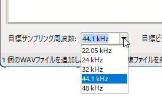
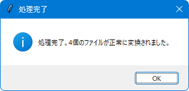

# WAVサンプリング周波数一括変更ツール (WavResampler)

このツールは、複数のWAVファイルのサンプリング周波数を一括で、または自動で変更することができるWindows向けデスクトップアプリケーションです。

  

## 主な機能

*   **ドラッグ＆ドロップ**: WAVファイルをリストに簡単に追加できます（複数ファイル対応）。
*   **ファイル情報表示**: リストにはファイル名、フルパス、元のサンプリング周波数、処理状態が表示されます。
*   **目標サンプリング周波数指定**: 変換後のサンプリング周波数をHzまたはkHz単位で指定できます。
*   **一括変換**: リストに追加された全てのファイルを指定したサンプリング周波数に変換し、指定フォルダに保存します。
*   **自動変換**: チェックボックスをONにすると、ファイルがリストに追加された時点で自動的に変換処理が開始されます。
*   **リスト管理**: リスト全体のクリア、選択したアイテムの消去が可能です。
*   **ステータス表示**: 現在の操作状況や処理結果がリアルタイムで表示されます。

## 必要なもの

*   **対応OS**: Windows

### 開発・ビルド情報 (参考)

本アプリケーションの実行に際して、エンドユーザーが別途Pythonやライブラリをインストールする必要はありません。以下の情報は、開発時の環境および使用した主要ライブラリに関する参考情報です。

*   **Python**:
    *   開発時使用バージョン: `3.12.10`
    *   (参考) ビルドに使用したライブラリの互換性を考慮すると、一般的に **Python 3.8 以上** での開発・ビルドが推奨されます。

*   **主要Pythonライブラリ**:

    | ライブラリ名    | 本ツールでの主な用途     | 開発時想定バージョン (目安) | 最新版 (2024年5月時点目安) | Python互換性 (最新版目安) |
    | :-------------- | :----------------------- | :-------------------------- | :------------------------- | :------------------------ |
    | `tkinter`       | GUIフレームワーク        | Python 3.12.10 同梱       | Python同梱                 | Python 3.x                |
    | `tkinterdnd2`   | ドラッグ＆ドロップ機能   | 0.3.1                       | 0.3.1+                     | Python 3.6+               |
    | `librosa`       | オーディオ分析・リサンプル | 0.10.1                      | 0.10.2.post1               | Python >=3.8              |
    | `soundfile`     | WAVファイルの読み書き    | 0.12.1                      | 0.12.1                     | Python >=3.7              |

    *   **注釈**:
        *   上記の「開発時想定バージョン」および「最新版」は、このドキュメント作成時点での一般的なものです。
        *   各ライブラリの正確なPythonバージョン互換性や最新情報については、それぞれの公式ドキュメント (PyPIなど) をご確認ください。

(エンドユーザーはPythonや上記ライブラリのインストールは不要です。`WavResampler.exe`ファイル単体で動作します。)

## 使い方

### 1. アプリケーションの起動

1.  配布された `WavResampler.exe` ファイルをダブルクリックして実行します。
2.  メインウィンドウが表示されます。

    

      
    

### 2. ファイルの追加

1.  変換したいWAVファイルをエクスプローラーなどから選択します。
2.  選択したファイルを、ツールウィンドウ内のファイルリスト領域（「ファイルリスト (WAVファイルをここにドラッグ＆ドロップ)」と書かれた部分）へドラッグ＆ドロップします。
3.  ファイルがリストに追加され、ファイル名、パス、現在のサンプリング周波数、状態（初期は空欄）が表示されます。

    

      
      
    

### 3. 目標サンプリング周波数の設定

1.  「目標サンプリング周波数」の入力欄に、変換したい周波数の数値を入力します（例: `48000`、`22.05`など）。
2.  入力欄の右隣にあるドロップダウンリストから、入力した数値の単位（`Hz` または `kHz`）を選択します。

    

      
      
    

### 4. 変換モードの選択と実行

#### 4.1. 一括変換モード（手動実行）

1.  「自動で変更する」チェックボックスが **オフ** になっていることを確認します。
2.  リストにファイルが追加され、目標サンプリング周波数が設定されたら、「一括変換実行」ボタンをクリックします。
3.  「変換後のファイルの保存先フォルダを選択してください」というダイアログが表示されます。変換されたファイルを保存するフォルダを選択し、「フォルダーの選択」をクリックします。

    

       
      *(例：ここでは、ピクチャフォルダに作成した返還後フォルダを選択している)*
    

4.  変換処理が開始されます。各ファイルの処理状況はリストの「状態」列とウィンドウ下部のステータスバーに表示されます。
5.  全ての処理が完了すると、メッセージボックスで結果が通知されます。

    

      
    

    *(ここに一括変換が完了し、リストの状態が更新されたスクリーンショットを挿入してください。上記はサンプルパスです。)*

#### 4.2. 自動変換モード

1.  「自動で変更する」チェックボックスを **オン** にします。
2.  初めて自動変換モードをONにした場合、または出力先が未設定の場合は、「自動変換ファイルの保存先フォルダを選択」ダイアログが表示されます。自動変換されたファイルを保存するフォルダを選択します。
    *   この出力先は、自動変換モードがONの間、記憶されます。
3.  目標サンプリング周波数を設定します。
4.  この状態でWAVファイルをリストにドラッグ＆ドロップすると、ファイルが追加されると同時に「状態」が「キュー済」となり、バックグラウンドで自動的に変換処理が開始されます。
5.  処理が完了すると、リストの「状態」列が「処理済」または「エラー」に更新され、ステータスバーにも結果が表示されます。

    

      
    

    *   **注意**: 自動変換モード中でも、目標サンプリング周波数の設定はいつでも変更可能です。ただし、既にキューに入っているファイルは、キューイングされた時点のサンプリング周波数設定で処理されます。

### 5. リストの操作

*   **リストクリア**: 「リストクリア」ボタンをクリックすると、ファイルリスト内の全てのアイテムが削除されます。
*   **選択消去**:
    1.  リスト内の消去したいアイテムをクリックして選択します（複数選択可: Ctrl+クリック、Shift+クリック）。
    2.  「選択消去」ボタンが有効になるので、クリックします。
    3.  選択されたアイテムがリストから削除されます。

    

       
      **(例：ここでは、sample_003.wavを選択して選択消去ボタンを押そうとしている)** 
    

    

       
      **(例：sample_003.wavがリストから消去された後)** 
    

### 6. アプリケーションの終了

ウィンドウ右上の「×」ボタンをクリックします。
終了確認のメッセージボックスが表示されるので、「OK」をクリックするとアプリケーションが終了します。

## 注意事項

*   処理対象はWAVファイル(`.wav`, `.wave`)のみです。
*   変換後のファイル名は、元のファイル名に `_resampled_目標周波数Hz` が付加された形式になります。（例: `sample.wav` → `sample_resampled_48000Hz.wav`）
*   非常に大きなファイルや多数のファイルを一度に処理する場合、時間がかかることがあります。
*   エラーが発生した場合は、ステータスバーやメッセージボックスで通知されます。リストの「状態」列も「エラー」と表示されます。
*   アンチウイルスソフトによっては、初回起動時に警告が表示される場合があります。信頼できる配布元からのファイルであることを確認してください。

---

**画像の準備について:**

上記のMarkdown内で `` となっている部分は、実際のスクリーンショット画像へのパスまたはURLに置き換えてください。
GitHubリポジトリに `README.md` と同じ階層、または `images` フォルダなどを作成して画像を配置し、相対パスで指定するのが一般的です。

例: リポジトリのルートに `images` フォルダを作成し、そこに `main_window.png` を置いた場合
``
